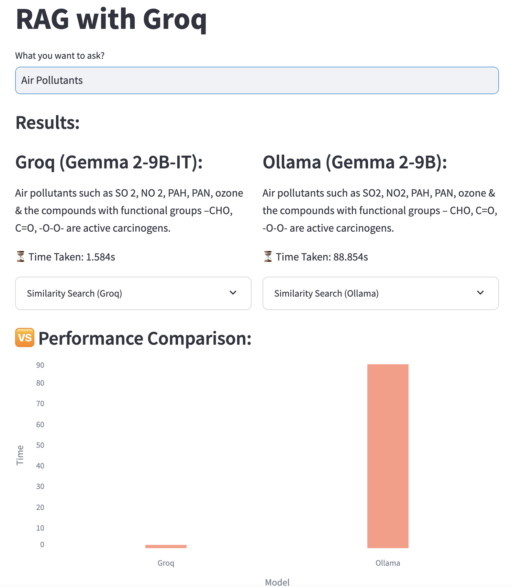

# GroqWarp
GroqWarp is a Streamlit-based app designed to compare the performance of **RAG (Retrieval-Augmented Generation)** using two powerful models: **Groq** and **Ollama**. The app enables users to input a question, process it with both models using document retrieval from a custom dataset, and compare the response times and accuracy.



## Tech Stack

        

## Features

- **Model Comparison**: Compare Groq (Gemma 2-9B-IT) and Ollama (Gemma 2-9B) based on performance (speed and accuracy) for a given question.
- **Document Retrieval**: Uses **FAISS** to retrieve context from uploaded PDF documents.
- **Side-by-Side Results**: Display responses from both models along with the time taken to process.
- **Performance Visualization**: A bar chart for visual comparison of response times between the models.
- **Textual Context**: View the context from the documents used to generate responses.

## Installation

To install and set up the GroqWarp project, follow these steps:

1. **Clone the repository**:
    ```bash
    git clone https://github.com/your-username/GroqWarp.git
    cd GroqWarp
    ```

2. **Set up a virtual environment** (using `conda` or `venv`):
    ```bash
    conda create --name groqwarp-env python=3.8
    conda activate groqwarp-env
    ```

3. **Install dependencies**:
    ```bash
    pip install -r requirements.txt
    ```

4. **Ensure the following dependencies are included in `requirements.txt`**:
    ```txt
    faiss-cpu==1.10.0
    groq==0.18.0
    langchain-groq==0.2.5
    langchain-ollama==0.2.3
    PyPDF2==3.0.1
    langchain-google-genai==2.0.11
    langchain==0.3.20
    streamlit==1.43.1
    langchain_community==0.3.19
    python-dotenv==1.0.1
    pypdf==5.3.1
    pandas
    altair
    ```

## Prerequisites

Before running GroqWarp, make sure you have the following prerequisites:

- Python 3.12 or higher
- Conda (or virtual environment)
- Required libraries (`faiss-cpu`, `groq`, `langchain`, `streamlit`, `pandas`, `altair`, etc.)

To set up the environment using Conda and install dependencies from the `requirements.txt` file, use the following command:

```bash
conda create --name groqwarp-env python=3.12
conda activate groqwarp-env
pip install -r requirements.txt
```

## Run the App
Make sure to start Ollama before running the app to ensure both models are properly initialized. You can start Ollama by running the following command:

```bash
ollama serve
```

Start the app by running the following command:

```bash
streamlit run app.py
```

The app will launch in your browser at http://localhost:8501.

## Usage
**Upload your dataset:** Place your PDF files in the `./pdfs` directory.

**Ask a question:** Input a question in the provided text field to compare how `Groq` and `Ollama` handle it.

**View results:** The app will display the answers from both models and the time taken to process the question.

**Performance Comparison:** A bar chart will show the time difference between the two models.


## Contributing
Welcome contributions to GroqWarp! If you would like to contribute, please fork the repository, 
create a new branch, and submit a pull request with your changes.

## License
GroqWarp is open-source software licensed under the MIT License. See the LICENSE file for more information.

## Acknowledgements

**Libraries Used:**
Streamlit for the app interface.
FAISS for document similarity search.
Groq and Ollama for language model inference.
Langchain for document processing and retrieval.
Altair for data visualizations.

